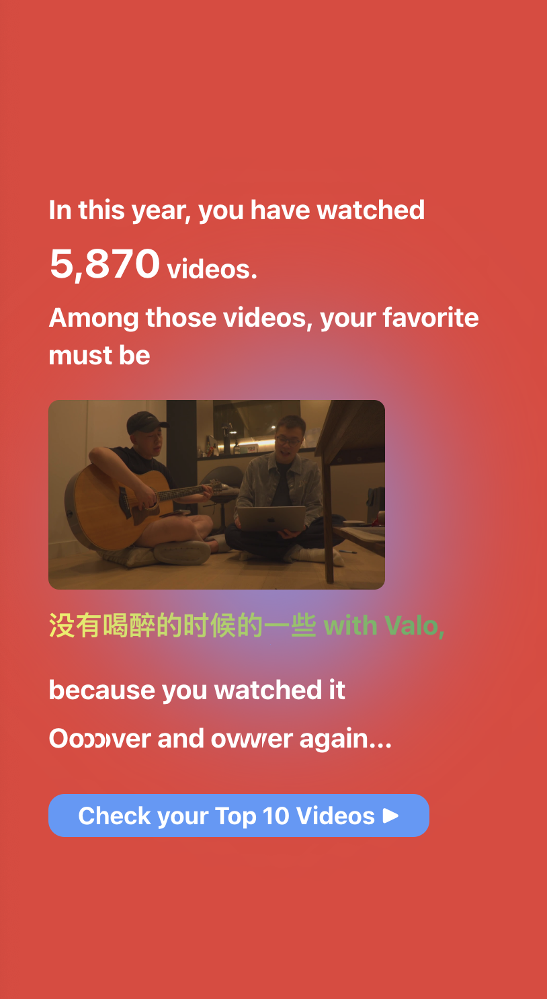
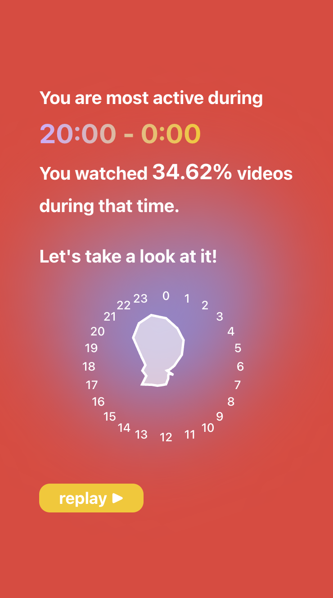
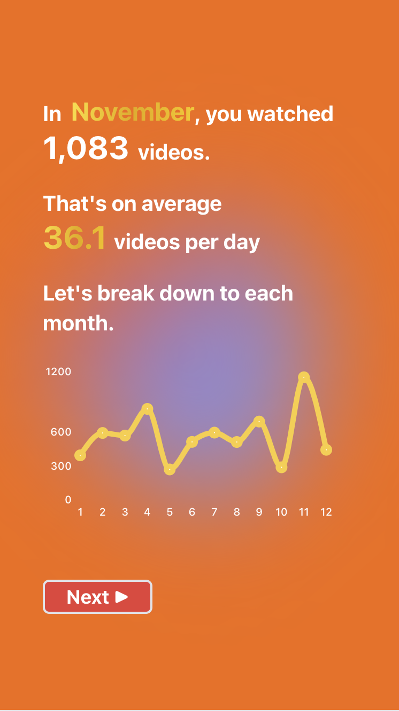

# YouTube Annual Report

A web app that reads the YouTube watch history from Google Takeout and generate a tailored Annual Report for user.

  

    
    
    
    
  

## Overview

This web app will guide users step by step to get their YouTube watch history from Google Takeout, and generate a Annual Report with a user-friendly analytics that recaps user's watch history with YouTube.

## Features

- User can get their YouTube data from Google Takeout with a detailed step-by-step guide.
- User can upload their data without being worried their data might be used for any other reasons.
- User can get their 2023 YouTube History Report in a vivid and friendly User Interface, including
  - The Number of videos that they watched,
  - The Most Watched Video,
  - The Top Videos
  - The Favourite Channel
  - The Top Channels
  - Breakdown by Month
  - Breakdown by hours and time period.

## How to access

The web app is currently deployed on [Heroku](https://youtube-history-report-c80c692ddefb.herokuapp.com/).
